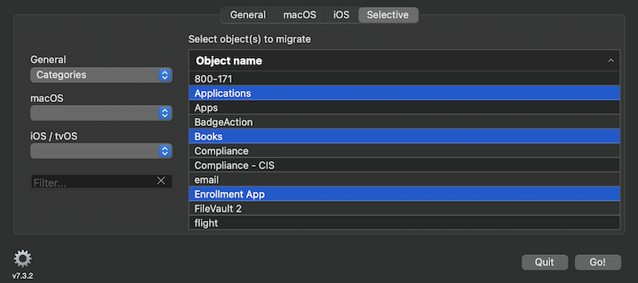
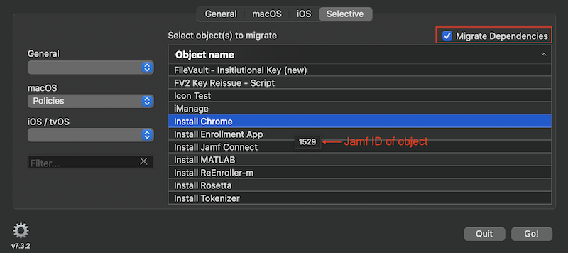

# Jamf Migrator

Download: [JamfMigrator](https://github.com/jamfprofessionalservices/JamfMigrator/releases/download/current/jamf-migrator.zip)

A tool to migrate data granularly between Jamf Pro servers


Migrate items from one Jamf server, or XML file(s), to another.  If an item (based on name) within a category exists on both source and destination, the destination item will be updated with values from the source server.
  
  
  Groups, Policies, and Configuration Profiles can be targeted to a particular site.
  

Feedback in the GUI gives a simplistic overview of the success of a transfer:
* Green - everything transferred.
* Yellow - some items transferred.
* Red - nothing transferred.
* White - nothing to transfer.


**Limitations/requirements to be aware of:**
* Passwords can not be extracted through the API which impacts migrating distribution points, computer management account, account used for LDAP - credentials must be reset on the destination server.
* Icons associated with Mac App Store apps are not migrated (can't be migrated).
* Only AFP and SMB shares can be migrated.
* Patch management is not available through the API impacting smart groups dependent on patch management extension attributes.
* Buildings - the API only allows the name to be migrated.
* If endpoints (computers, policies, configuration profiles...) have duplicate names on the source server issues will arise if the app is used to update those items from the source to destination server.  As each item is migrited it will overwrite the previous item with the same name.
* Migrating smart/static groups with criteria containing groups will fail if the parent group tries to migrate before the group in the criteria.  Migrating groups several times should allow all the nested groups to migrate before the parent group.
* Institutional disk encryptions that contain the private key cannot be migrated.
* Approved Kernel Extension payloads that contain bundle IDs will be dropped from the Configuration Profile.
* Approved Kernel Extension - the display name for the Approved Team ID does not migrate.

 
The 'Selective' tab provides the ability to select a subset of items within a category.  For example you might only want to transfer 4 new scripts from a larger pool of existing scripts.
  
  
Note: Policies are listed along with the their ID.  They'll be listed with a format of: policy name (ID)

Also, policies may have their dependencies checked/migrated using the Migrate Dependencies button.  Only 'top-level' dependencies are checked.  i.e. if the scope is being migrated and contains nested computer groups or groups assigned to a site that doesn't exist on the destination server the policy migration will likely fail.  Adding smart migrations is planned for other items.



When importing XML files they must be organized into folders that, for the most part, mirror their respective API nodes. i.e. computer XML files in a folder labeled computers, mobile devices in a folder called mobiledevices. Exceptions to this are group items, for example computer groups are split into a smartcomputergroups folder and staticcomputergroups folder. This is also how jamf-migrator exports files. Then when importing, select the folder that contains the API nodes we wish to update. For example, if selecting files generated by exporting data with jamf-migrator we would select the folder called raw.


  
**Important:** Trimmed XML files cannot be used as they are missing data required for the migration. 

**Preferences:**
* macOS Configuration Profiles 
* macOS Applications 
* Restrictions 
* Policies 
* Mobile Device Configuration Profiles 
* Mobile Device Applications 
* Static Computer Groups 
* Static Mobile Device Groups 
* Static User Groups 

In addition, Policies can be copied in a disabled state.


Options to export XML from the source server are also available.


* Raw Source XML gives you the XML from the source server before any modifications, like removing the id tag(s) and value(s).
* Trimmed Source XML give you the XML that is sent to the destination server.
* Save only saves the XML files and does not send them to the destination server.
* Save the object XML either with or without its scope.  Unchecked removes the scope.
* Note Save only and Raw Source XML options should not be selected when File Import is being used.

Options for migrating object(s) (groups, policies, and configuration profiles) to a particular site can be set.


* When copying an object to a site, the site name is appended to the object name.
* Groups with groups as a criteria will not copy properly, moving them should be fine.

**Migration Summary:**

* To get details on how many items were created/updated or failed to migrate type ⌘S, or select Show Summary under the File menu.
  
  
   
* Additional information about each count can be obtained by clicking on the number. For example, if we want to see a list of the 28 failed scripts, click on the 28.
  
  
  
  
Information about successes/failures can be found in the log, located in 

```
~/Library/Containers/com.jamf.jamf-migrator/Data/Library/Logs/jamf-migrator/<date>_<time>_migration.log
```

If you have used jamf-migrator and saved passwords you will see the following after launching a new version. 
 
 
 If you'd like the new version to access existing credentials select the desired option.


**Important:**

* There are many dependencies between items, if they are not met transfers fail.  For example, if a policy is site specific the site must be migrated before the policy; if a distribution point has a building and/or department defined those need to migrate first...  If everything is migrated the order of sections is already taken care of, if you choose not to move some items that's where you can have issues.
* Summary window doesn't seem to be the most responsive.  May need to click the window or give the cursor some extra motion before the detailed summary appears.


**Note:** the app can also be used to clear out a Jamf server.  Typing the following after launching the app will set it into removal mode.  Items from the destination server are deleted once Go is clicked.

```
touch ~/Library/Containers/com.jamf.jamf-migrator/Data/Library/Application\ Support/jamf-migrator/delete
```

* You can also toggle the mode using &#8984;D.

## History

**v5.2.2**

* Code cleanup and fix issue (#50) where app would crash if preference for saveRawXmlScope was missing.

**v5.2.1**

* Fixed smart/static group lookups giving 404 responses.

**v5.2.0**

* Exporting (saving) raw or trimmed XML now has the to include/exclude the scope.
* Updated help.
* Better handleing in bringing the preferences window to the foreground when it is already open, but behind another window.

**v5.1.0**

* Addressed several issues around GET and POST counters, including issues #43 and #48.
* Updated UI.  Replaced POST with either POST/PUT (for migrations) or DELETE (for removals), issue #47.
* Fixed issue where user/iOS device/computer groups would not migrate if they were the last item to migrate.
* Allow resizing of summary window.
* Resolved issues around migrating policies along with their dependencies in the proper order.
* Added summary for items removed.

**v5.0.3**

* Provide additional logging around icon migration.  Slight change in process (issue #46).
* Better handling of Jamf Pro API (UAPI) calls.
* Use encoding different than what the Jamf server uses for the ampersand in the name of a macOS configuration profile (issue #45).

**v5.0.1**

* Fix app crashes during XML export.

**v5.0.0**

* Introduce smart selective migrations for policies.  When migrating a policy dependent items (scripts, packages, printers, computer groups, ...) will also be migrated/updated, if desired.  Only 'top-level' dependencies are checked.  i.e. if the scope of a policy is being migrated and contains nested computer groups or groups assigned to a site that doesn't exist on the destination server the policy migration will likely fail.  Adding smart migrations is planned for other items.
* Resolve problem of migrating LDAP Jamf User Groups to Jamf Pro v10.17+ (issue #42).

**v4.1.3**

* Resolved app crash when doing a selective migration on groups.

**v4.1.2**

* Added site None to list of available sites to migrate to.  
* Increased concurrent threads for post/put/delete from 1 to 3.  
* Speedier listing of objects when using selective migration.

**v4.1.0**

* Added the ability to migrate disk encryption configurations.  Since passwords cannot be migrated Institutional configurations containing the private key will not migrate.

**v4.0.0**

* Added the ability to migrate objects (groups, policies, and configuration profiles) to a particular site, either on the source server or another server.
* Re-added button to bring up preferences.  

**v3.3.5**

* Resovled script parameter issue (#34)

**v3.3.4**

* Resovled display issue with High Sierra (issue #31)
* Resovled issue where blank lines were removed from scripts when migrated (issue #33)

**v3.3.3**

* Markdown formatting and spelling corrections.  Thanks @homebysix

**v3.3.2**

* Fixed issue where icons were not migrating
* Fixed app crash issue (#28) that resulted when running in removal mode and no credentials were entered for the source server.
  
**v3.3.0**

* Adjustment to the GUI for Dark Mode
* App is now sandboxed, hardened, and notarized
* Updated help with new images and file paths
  
**v3.2.2**

* Fixed issue #24, group and policy selective removal broken.
* Changed arrangement of drop-downs on selective to align with suggested migration order.
* Split selective migration/removal or group items into smart and static.
* Fixed issue where the listing of items in selective mode would not refresh as desired.

**v3.2.0**

* Tabs reordered, General tab is now first to align with suggested migration order.
* Updated tabs/buttons used for navigating between General, macOS, iOS, and Selective sections.
* Buttons for items to migrate are off by default when the app is launched.
* You can now switch back and forth between removal and migration modes using &#8984;D.
* When using the Selective tab, items are removed from the list as they are deleted from the server.  Once all selected items are removed the list is grayed out.
* Fixed an issue with Policies and Selective migration where the app could become unresponsive.  Policies should be listed much more quickly.
* Fixed an issue where groups would not be listed when working with the Selective tab.
* Fixed potential crash when importing a software update server from an XML file.
* Fixed issue where xxxgroup would be displayed along with staticxxxgroup and smartxxxgroup in the summary.
* Fixed an issue where a computer record would get resubmitted indefinitely.
* Fixed issued with log file names.
* Fixed issue where migration order might not go as designed.

**v3.1.0**

* Resolved app crashes when exporting XML and destination server field is blank.
* Resolved potential app hanging when migrating extension attributes that include patch policy EAs.
* Re-tool preferences.
* Removed preferences button and help button to prevent duplicate windows from opening.
* Resolved issue where scripts could get corrupted when migration.
    
**v3.0.6**

* Items will now migrate if category, building, or department is missing on the destination server. The field will be blanked out to allow the migration.

**v3.0.5**

* Policies with the Account payload can now be migrated.  **Note:** Account password is set to `jamfchangeme`.
* Resolved an issue where a smart group with thousands of computers would not get cleared.
* Resolved issue migrating machines with duplicate serial numbers or MAC addresses.  Duplicate addresses are cleared.
* Resolved issue trying to copy computers with no serial number.
* Resolved issue where a policy name starting with a space would lose the leading space when it was posted to the new server.
* References to the source server in the App Config are now updated to the destination server.

**v3.0.0**

* Added ability to use locally stored XML files as a source rather than a server.
* Added ability to migrate macOS and iOS Mac App Store apps.

**v2.8.0**

* Moved text manipulation to main thread, fixing issues where the endpoint URL was incorrect.
* **Changed tab order** - tabs through server to username to password.
* Updated migration order to address issue #18.
* Removed forced debug mode accidentally left in the previous beta.
* Lightly grayed out GET/POST related fields to indicate they are not for user input.
* Added button for quick access to preferences and help.
* Help window can now be displayed while running migrations.
* Changes to the GUI, moved tabs to top of section and added arrows to selective migration subjects.
* Added removing the scope from static computer groups/mobile device groups/user groups, addressing issue #19.
* Grayed out source server when doing removals to make it more clear from which server items get removed.
* Updated Help.
* Added 'check for updates...' under jamf-migrator in the menu bar.
* Added additional logging, in debug mode. Minor code adjustments.
* Added ability to export xml. Added cache clearing to authentication / server availability check in an effort to resolve 503 errors when the api is actually available.

**v2.7.2**

* Corrected encoding issue (#17) of special characters that caused authentication failures.

**v2.6.3**

* Corrected an issued with self service icons not migrating if the icon name contained a space.

**v2.6.2**

* Resolve issue #14, items not migrating in the proper order.

**v2.6.0**

* Deferrals no longer stripped from policies.
* Only log xml from failed items when in debug mode.
* More informative logging, give reason of failure along with http status code.
* Move history files to ~/Library/Logs/jamf-migrator and change extension to log. Refer to them as log files now.
* Added summary to provide count of items created, updated, and failed (&#8984;S) after a migration run.
* Patch Extension Attributes are no longer migrated.
* Log file naming has been corrected, for future logging. Current logs named incorrectly need to be manually deleted or renamed. Issue#13
* Added recommended migration and dependencies to help. Issue#12
* Migration of icons used in self service for newly created policies. Updating an existing policy will not update the existing icon on the destination server.

**v2.2.5**

* Added migration of computer configurations.  Note, it is possible to delete the parent of a smart configuration, thus orphaning the 'child' config.  An orphaned child configuration is not accessible through the API, as a result it cannot be migrated.  In the event the orphaned child configuration(s) also has child configuration(s), those child configuration(s) are turned into parent configuration(s).
* Added ability to select frequently used source/destination servers from the user interface.  Up to 10 server are selectable by using the up/down arrows to the right of the URL text box.

**v2.1.5**

* Added migration of dock items.
* Added stop button to stop the migration in progress.
  
**v2.1.4**

* Added migration of directory bindings.
  
**v2.1.3**

* Fixed smart group migration failures when done selectively.
* Fixed advanced computer search duplication if migrated more then once, they should update now if changed.
* Fixed authentication verification when Jamf Server utilizes SSO (thanks @ftiff).

**v2.1.0**

* Added the ability to migrate Jamf server accounts (users and groups).  Newly created accounts on the destination server will be created without a password (can't migrate passwords).  The account being used to authenticate to the destination server is not migrated if it also exists on the source server.  The migration of accounts depends on the existence of related sites and LDAP servers in order to be successful.
   
**v2.0.0**

* Change to the user interface.  Grouped similar categories together.
* Added iOS items.
* Selective migration now allows the selection of multiple items, using control and/or shift key.
* Added selective removal of items within a category.

**v1.2.1**

* fixed issue where app would hang if last/only item migrated had no endpoints.
* credentials no longer needed for source server when removing data.
* UI button improvements for select all/none (thanks @jdhovaland).

**v1.2.0**

* Fixed the issue migrating computers with the xprotect tag having no value.
* Selective migration now lists endpoints alpha-numeric.
* Added debug logging. To enable, launch the app from terminal:

```
…/jamf-migrator.app/Contents/MacOS/jamf-migrator –debug
```

* Debug info is added to the history file
* Easily open the history folder from View on the menu bar, or &#8984;L

